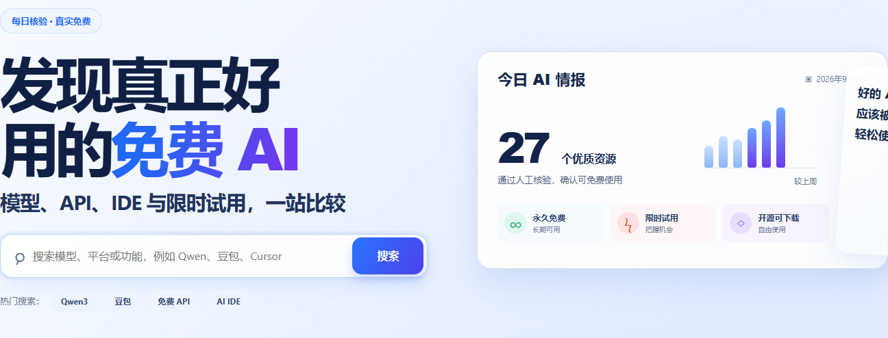

# FreeLLM · 中国免费 AI 资源索引

一个面向中文用户的免费 AI 资源目录，整理免费模型、免费额度、免费 IDE、API、开放权重和相关工具。

## 在线展示

- 站点首页：[freellm.top](https://freellm.top/)
- Vercel 预览：[freellm-omega.vercel.app](https://freellm-omega.vercel.app/)
- GitHub 仓库：[xdguo-design/freellm](https://github.com/xdguo-design/freellm)



## 当前内容

- 36 个已整理的 AI 服务和模型条目
- 按免费额度、学生优惠、免费 IDE、API、开放权重等场景筛选
- 记录平台、限制条件、地区、注册要求和官方入口
- 展示来自 GitHub、Hugging Face 等平台的公开外部信号（例如 Stars、Likes、Downloads）
- 外部信号只作为原始公开数据展示，不伪造本站评分，也不把不同平台的数据强行合并成一个分数

## SEO 页面

- 首页：`/`
- 资源详情页：`/offers/<offer-id>/`（当前 36 个）
- 分类页：`/category/<slug>/`（当前 7 个）
- 中文 API 指南页：`/guides/free-llm/`
- 页面由 `data/offers.json` 自动生成，统一更新 sitemap 和站内链接；指南页参考 [Free-LLM 中文 README](https://github.com/nejib1/Free-LLM/blob/main/README.zh-CN.md)，使用前仍需以 Provider 官方页面为准

生成或检查 SEO 页面：

```powershell
python scripts/build_seo_pages.py
python scripts/build_seo_pages.py --check
```

## 项目结构

```text
data/offers.json                 资源目录数据
data/providers.json              平台与提供商信息
data/community-signals.json      外部公开信号快照
design/free-china-ai-index.html  网站页面
offers/<id>/index.html            资源详情页（生成文件）
category/<slug>/index.html        分类页（生成文件）
guides/free-llm/index.html         Free-LLM 中文指南页（生成文件）
ads.txt                          Google AdSense 授权声明
robots.txt                       搜索引擎抓取规则
sitemap.xml                      站点地图
llms.txt                         面向 AI/搜索系统的站点说明
vercel.json                      Vercel 路由配置
```

## 本地运行

直接启动静态服务器：

```powershell
python -m http.server 8000
```

然后打开 <http://localhost:8000/design/free-china-ai-index.html>。

如果希望本地行为与线上根路径一致，可以使用 Vercel CLI：

```powershell
npx vercel dev
```

## 验证

```powershell
pytest -q
python scripts/build_static.py --check
```

## 发布

生产站点部署在 Vercel，根路径会指向 `design/free-china-ai-index.html`。更新页面或数据后，应先通过验证，再发布生产版本并检查首页、`/ads.txt`、`/robots.txt` 和 `/sitemap.xml`。

Google AdSense 是否显示广告还取决于 AdSense 审核、流量、广告填充和页面策略；代码中已包含 AdSense 脚本，`ads.txt` 用于声明授权发布商。

## 数据说明

目录内容和外部信号会随官方平台状态变化。使用前请通过条目中的官方链接再次确认额度、地区限制、服务条款和隐私政策。
