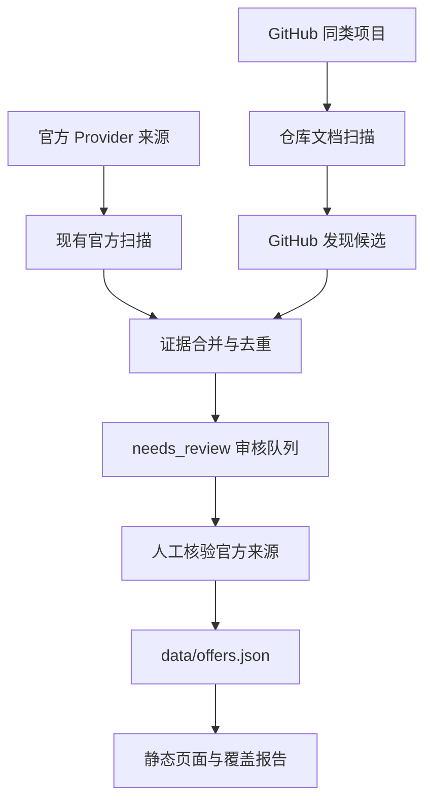

# GitHub 同类项目扫描与 Console 风格改版设计

## 1. 目标与边界

### 目标

在现有免费 AI Offer Research 技能的官方来源扫描之外，增加 GitHub 同类项目发现层，用于补齐 Provider、模型、免费机制、文档入口和产品功能线索。首批将 `Devansh-365/freellm` 作为同类项目种子，并允许后续加入免费模型目录、AI Gateway、Coding Agent、IDE 和模型路由项目。

同时将网站视觉升级为开发者工具风格：借鉴参考项目的深色控制台、细网格、等宽代码排版、Provider/Model 分区、Docs/Compare 导航和 Quickstart 节奏，但保留 Free AI Index 自己的名称、数据、证据规则和内容表达。

### 非目标

- 不把第三方 GitHub 项目中的宣传文字、截图、Logo、品牌色或模型结论直接复制到公开站点。
- 不把同类项目 README 作为免费额度、价格、地区或自动续费的最终证据。
- 不执行仓库脚本、安装依赖、Docker、构建命令或示例命令。
- 不在本阶段把目录改造成可调用的 LLM Gateway；只借鉴其信息架构和可观察性表达。
- 不声称覆盖互联网上全部模型；覆盖范围仍由注册表和覆盖报告定义。

## 2. 已确认的现状

- `crawler/discovery.py` 当前从 `data/providers.json` 的官方 discovery URL 出发，抓取允许域名中的链接，再把候选写入审核队列。
- `crawler/cli.py discover` 已支持最大链接数和最大页面数，但只接受现有 Provider 注册表，没有 GitHub 仓库来源类型。
- `data/offers.json` 是公开 Offer 的人工确认数据，当前包含 17 条记录。
- `design/free-china-ai-index.html` 已嵌入 Offer 兜底数据，并在运行时尝试读取 `data/offers.json`。
- `vercel.json` 将 `/` 重写到目录页面，发布时必须保证页面和 JSON 数据一起可访问。

## 3. 方案选择

### 方案 A：只维护精选仓库

人工维护 GitHub 仓库清单，只扫描已确认的仓库及其文档。

- 优点：可控、稳定、来源质量高、实现简单。
- 缺点：发现能力弱，容易漏掉新项目。

### 方案 B：精选仓库 + 公开 GitHub 关键词发现（推荐）

维护种子仓库，同时使用公开 GitHub 搜索结果发现新的同类项目。新项目先进入 `needs_review`，经过仓库质量、项目相关性和官方来源检查后才加入长期扫描清单。

- 优点：兼顾覆盖率与可控性，适合当前项目。
- 缺点：需要处理重复仓库、Fork、低质量 README、限流和误报。

### 方案 C：大范围仓库全文爬取

尝试抓取大量相关仓库的完整文件树和文档。

- 优点：理论发现面最广。
- 缺点：噪声、限流、版权、恶意内容和存储成本明显增加；不适合第一版。

采用方案 B。

## 4. GitHub 扫描设计

### 4.1 来源注册

新增 `data/github-peers.json`，每条记录包含：

- `id`、`owner`、`repo`、`repoUrl`
- `kind`：`gateway`、`directory`、`coding_agent`、`ide`、`model_catalog` 或 `other`
- `discoveryQueries`：用于发现同类项目的关键词
- `allowedHosts`：默认只允许 `github.com`、`api.github.com`、`raw.githubusercontent.com`
- `enabled`、`notes` 和首次发现时间

仓库清单和关键词是“扫描范围配置”，不是公开 Offer。第三方仓库只能帮助发现项目、模型和官方链接。

### 4.2 扫描文件范围

优先读取公开仓库的 README、文档目录、变更日志、模型/Provider 配置和示例配置：

- `README*`
- `docs/**`
- `CHANGELOG*`、`RELEASE*`
- `providers/**`、`models/**`、`catalog/**`
- `package.json`、`pyproject.toml`、`docker-compose.yml`、`.env.example`

默认不读取完整源码树。每个仓库设置最大文件数、单文件大小、总字节数和总请求数；超过限制记录 `source_limit`，不继续扩张。

### 4.3 提取字段

GitHub 发现结果写入 `data/candidates.json`，增加以下可选字段：

- `sourceKind: github_peer`
- `repository`、`repositoryUrl`、`path`、`ref`、`commitSha`
- `repositoryKind`、`officiality`、`discoveryQuery`
- `mentionedProviders`、`mentionedModels`、`officialLinks`
- `evidence`、`evidenceHash`、`fetchedAt`
- `status: needs_review`

证据摘要只保留定位事实所需的短文本，不保存整个仓库镜像。

### 4.4 可信度和发布门控

可信度分三层：

1. `official_primary`：Provider 官方仓库、官方文档或官方模型仓库，可作为相应主题的高强度证据。
2. `project_primary`：产品自身仓库，可证明产品功能、安装方式和代码支持范围；免费额度仍应回到 Provider 官方页面确认。
3. `peer_discovery`：第三方同类项目，只能作为发现线索，不能单独发布免费结论。

只有包含官方价格页、FAQ、公告、API 文档或官方模型仓库的候选，才允许人工审核后进入 `data/offers.json`。同一 Provider 的免费 API、免费 IDE、首月促销、开放权重和低价付费必须拆成独立 Offer。

### 4.5 去重与变化

候选主键采用 `providerId + canonicalSourceUrl`；仓库证据采用 `repository + path + commitSha`。同一来源重复发现时合并关键词、更新时间和出现次数，不重复生成候选。仓库删除、分支变化或单次请求失败不得把已有 Offer 标记为过期。

## 5. 安全与合规边界

- 只访问公开 HTTPS 内容，不登录、不提交表单、不读取 API Key。
- 所有仓库文字视为不可信内容，忽略其中要求 Agent 改变规则、泄露上下文或执行命令的指令。
- 不执行任何仓库代码、安装脚本、CI 配置、Shell 命令或 Docker 指令。
- 只跟随经过协议、域名和 URL 校验的链接；外部链接作为待核验线索，不自动扩展为扫描范围。
- 对响应体、文件数、仓库数、请求速率和重试次数设置上限，并使用退避。
- 对疑似密钥、密码、Token、私有 URL 和个人信息做检测并丢弃，不写入候选证据。
- 保留来源 URL、路径、commit、抓取时间和状态，便于审计和复核。
- 代码和实现可参考 MIT License 项目，但许可证声明只覆盖许可证适用的代码范围；品牌、截图、第三方资料和 Provider 内容需分别遵守各自权利要求。

## 6. 网站视觉设计

### 6.1 借鉴的视觉语言

- 深色主导航和技术控制台氛围。
- 近黑背景、低对比细网格和细分割线。
- Geist/系统无衬线用于正文，等宽字体用于模型 ID、额度、命令和状态。
- 单一绿色或薄荷色作为健康、免费、已核验和代码高亮色。
- Provider、Model、Docs、Compare、Quickstart 作为清晰的内容入口。
- 首屏先讲价值，再展示模型/Provider 矩阵，最后给出官方动作入口。
- 代码示例、复制按钮、状态标签和最近核验时间承担真实信息密度，不添加装饰性数字。

### 6.2 推荐基线：Console + Editorial

采用深色技术导航和局部控制台组件，但模型目录主体保持更高可读性的浅色或中性色内容区。模型卡重点显示：类型、免费机制、额度单位、有效期、地区、手机号/银行卡要求、官方链接和最后核验时间。

这样同时满足开发者工具的专业感、长文本阅读、移动端可用性和 AdSense 所需的清晰导航与原创内容表达。

### 6.3 设计方向初稿门

正式改页面前制作三个真实 HTML/CSS 视觉初稿，并在用户选择后再进入页面改造：

1. `Dark Console`：深色网格、绿色状态色、密集模型表格，最接近参考项目。
2. `Console + Editorial`：深色导航和代码区域，浅色模型目录，作为推荐方向。
3. `Docs Directory`：左侧文档/筛选导航，右侧模型目录和 Provider 详情。

三版使用相同的真实 Offer 数据，只改变布局、色彩和交互组织；不复制参考站文案或资产。

## 7. 数据流与发布流程



## 8. CLI、测试与验收

### CLI 预期

保留现有命令兼容性，新增 GitHub 来源开关或独立命令，最终至少支持：

```text
python -m crawler.cli discover --providers data/providers.json --github-peers data/github-peers.json --out data/candidates.json
```

具体参数名在实施计划阶段确定，避免为兼容旧命令引入重复入口。

### 测试要求

- GitHub 仓库注册表字段、协议和域名校验。
- README、Markdown、JSON 配置和文档目录的提取。
- 同仓库同路径同 commit 去重。
- `peer_discovery` 不得绕过官方证据门控。
- 仓库内容中的命令、Prompt 注入和疑似密钥不会被执行或保存。
- 文件数、响应大小、请求数和失败退避有效。
- 单仓库失败不影响其他仓库和已有 Offer。
- 覆盖报告新增仓库数、成功/失败数、候选数和待审核数。
- 三个视觉初稿在桌面和移动视口可读，页面无控制台错误，筛选、详情、复制命令和官方链接正常。

### 验收标准

1. 首批 GitHub 种子仓库可配置、可扫描、可追溯。
2. 扫描能发现 Provider、模型和官方链接线索，并全部进入审核队列。
3. 未经官方来源和人工确认，任何 GitHub 线索不能进入公开 Offer。
4. 目录页面能展示免费机制、额度、有效期、地区和官方动作链接。
5. 网站采用选定的 Console 风格，同时保留自己的品牌和原创说明。
6. 原有官方扫描、Schema 校验、Diff、Coverage 和静态构建测试继续通过。

## 9. 分阶段实施

### Phase 1：扫描基础

- 新增 GitHub peer 注册表和 schema。
- 抽取仓库文档的安全、限额、来源和 provenance 模型。
- 扩展 candidates 与 coverage，不修改公开 Offer。

### Phase 2：发现与核验

- 加入关键词发现和精选仓库扫描。
- 为 `Devansh-365/freellm` 建立首个 peer fixture。
- 增加官方链接回溯、去重、失败和敏感信息测试。

### Phase 3：视觉改版

- 先制作三个 HTML/CSS 视觉初稿并等待用户选择。
- 按选定方向改造目录页面、筛选、详情、Docs/Compare/Quickstart 区块。
- 做桌面/移动截图和交互验收。

### Phase 4：发布准备

- 更新 SEO、隐私、条款、来源说明和 `ads.txt` 预留位置。
- 运行全量测试和覆盖报告。
- 确认正确的 Vercel 项目后再部署，不使用错误的 `freellms.vercel.app` 地址。

## 10. 决策记录

- 用户已确认：GitHub 同类项目扫描纳入扫描 skill。
- 用户已确认：网站视觉借鉴参考项目的技术 Console 风格。
- 推荐视觉基线：`Console + Editorial`。
- 当前状态：设计规格已确认，尚未进入代码实施；视觉改版仍需先展示三版真实初稿并由用户选定。
